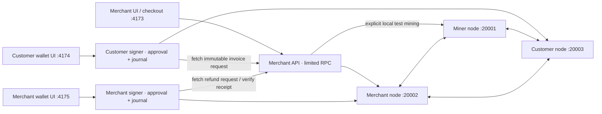

# Local development architecture — v0.4

Invoices, payments, refunds and monitoring use the selected pinned three-node devnet. The default `lave` profile runs the source-built LAVE Core on `lave-local-v1`; `LAVEPAY_NETWORK=atlas` explicitly selects the preserved Dash-backed `atlas-local-v1` profile. No wallets, invoices or balances migrate between them. The former single-node regtest remains a separate, optional legacy API on port 4180; its database and chain have not been migrated into the devnet.

The diagram shows the default LAVE RPC ports. Atlas retains 19901/19902/19903 and the original `.runtime/merchant/` and `.runtime/signer/` directories. The application HTTP ports are shared, so only one selected profile runs those applications at a time.

## Signing and recovery

The merchant API stores devnet invoices in `.runtime/lave/merchant/invoices.sqlite`. Its daemon-enforced RPC whitelist allows address derivation and necessary transaction reads, never wallet signing, key export or sending. This is a limited credential over a wallet that contains keys, not a watch-only wallet.

The customer wallet uses `.runtime/lave/signer/customer.sqlite`, shared with the existing CLI, and only its own node's signing transport. The refund wallet uses `.runtime/lave/signer/merchant.sqlite`. They import requests from the fixed merchant origin; browser input cannot choose an arbitrary upstream URL. Refund destinations are explicitly chosen by the merchant, never inferred from transaction inputs.

Preparation reserves inputs and shows the concrete transaction. A separate request carrying the displayed fingerprint authorizes signing. Each signer checks the pinned chain, actual confirmed inputs, wallet ownership, recipient, change, fees and expiry. Before a fresh signature it fetches the current immutable merchant request again. Incoming partial payments or changed refund totals stop signing. Distributed external receipts can still race this check; it is not an atomic payment lock across wallets.

Signed bytes and txid are persisted before broadcast. Recovery reconciles or reuses those bytes; it does not generate a second payment. Refund receipt synchronization can retry separately after the transaction succeeds. The merchant verifies the outgoing wallet transaction and exact recipient output before recording the receipt. Refunds are separate transactions, never reversals of chain history.

## HTTP and process boundaries

Every app binds loopback and checks Host. Wallet mutation endpoints additionally require their exact Origin, a role-specific HttpOnly SameSite cookie and matching CSRF token. Cookies are not isolated by port, hence distinct names per role. CSP, no CORS, no-store wallet responses and frame denial reduce cross-origin attacks; they are not merchant authentication.

All processes run under the same operating-system user. A compromised local process with filesystem access can read other runtime credentials. Production needs separate customer devices/accounts and stronger merchant signing isolation, recovery and authentication.

The dashboard observes all nodes through read-only credentials. The explicit development mining helper accesses only the miner's administrator cookie and waits for known pending transactions to relay before mining. Synchronization uses restricted monitoring credentials; it never loads the customer administrator cookie.

## Network identity

Every monetary operation verifies the exact chain name plus the pinned base genesis and named-devnet block at height one. The LAVE immutable request also binds its currency. Atlas request identities retain their original checksum-compatible shape; UI currency derives from their original identity. Generic devnet identity or address prefixes alone are insufficient. See [NETWORK-SPEC.md](NETWORK-SPEC.md). No independent mainnet replay-isolation claim is made.

All three nodes remain on one computer. No masternode quorums, InstantSend, ChainLocks or independent operators are present.
