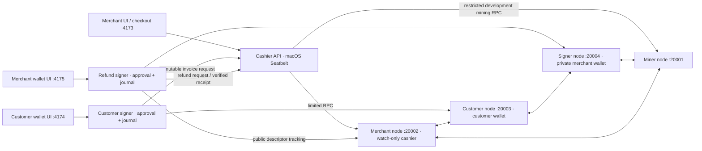

# Local development architecture — v0.5

The default `lave` profile runs four source-built LAVE Core nodes on the pinned
`lave-local-v1` payment chain. `LAVEPAY_NETWORK=atlas` selects the preserved
three-node Dash-backed `atlas-local-v1` profile. No wallets, invoices or balances
migrate between those chains. The optional legacy regtest API remains on 4180
with its own database.

The diagram shows LAVE RPC ports. Atlas retains RPC19901/19902/19903 and its
original wallet topology. All three application HTTP ports are shared, so only
one payment profile runs those applications at a time.

## Watch-only cashier and migration

The merchant API stores invoices in `.runtime/lave/merchant/invoices.sqlite`
and uses the `cashier` wallet on the merchant node. Core reports
`private_keys_enabled=false`; the wallet contains public descriptors only.
Its limited credential supports receiving-address derivation and transaction
inspection, but no signing, sending, key export or node administration.

Startup preserves the existing private merchant wallet in the separate signer
node and imports its public descriptors and receive labels into `cashier`.
It verifies descriptors, historical addresses and balances before archiving the
old private wallet outside the cashier node. A durable migration journal makes
restart verification idempotent. Existing invoice addresses and ledger records
remain valid. Details and sensitive archive paths are in [LAB.md](LAB.md).

Only the cashier allocates external invoice addresses. The private merchant
signer uses internal change addresses and tracks the cashier's public descriptor
range, so independent processes cannot accidentally reuse the same external
address index. It signs through RPC20004, never through the watch-only wallet.

## Signing and recovery

The customer service uses `.runtime/lave/signer/customer.sqlite`, shared with
its CLI, and the customer node's private wallet. Refunds use
`.runtime/lave/signer/merchant.sqlite` and the separate signer node. Each imports
requests from the fixed merchant origin; browser input cannot select an
arbitrary upstream URL. Refund destinations are explicitly chosen by the
merchant, never inferred from transaction inputs.

Preparation reserves confirmed inputs and displays the concrete transaction.
A separate approval must carry its saved fingerprint. Before a fresh signature,
the signer checks chain identity, actual inputs and ownership, recipient,
change, fees, expiry and the current immutable source request. Partial payments
or changed refund totals stop signing. An unrelated external payment can still
race that check; this is not an atomic lock across wallets.

Signed bytes and txid are persisted before broadcast. Retries reconcile or reuse
those bytes. Refund receipt synchronization retries independently and the
cashier verifies the actual transaction before recording it. Refunds are
separate transactions, never reversals of chain history.

Backup uses a cross-process role lock to capture the Core wallet and SQLite
journal together, then encrypts them with AES-256-GCM and a scrypt-derived key.
Recovery extracts only into a new directory and marks the journal as locked
against fresh preparation/signing. It permits explicit retries of already saved
signed bytes. It does not install the wallet into a running node or reconcile
later activity automatically. See [WALLET.md](WALLET.md).

## HTTP and operating-system boundaries

Every app binds loopback and checks Host. Wallet mutations require their exact
Origin, a role-specific HttpOnly SameSite cookie and a matching CSRF token.
CSP, no CORS, no-store wallet responses and frame denial reduce cross-origin
attacks. These sessions do not authenticate a wallet owner or merchant account.

On macOS the default launcher runs the cashier in a deny-by-default Seatbelt
profile. It can read application sources and restricted RPC credentials and
write its invoice database. It cannot read wallet files/admin cookies or
connect to signing HTTP ports 4174/4175. The mining helper now has its own
method-restricted credential; dashboard credentials remain read-only.

Core nodes and signing services remain outside that sandbox, under the trusted
host user. `LAVEPAY_ISOLATION=off` explicitly removes cashier confinement and is
currently required for an unconfined demo on other operating systems. This does
not provide customer-controlled devices or production custody isolation.

## Network identity and quorum experiment

Every monetary operation verifies the exact chain name plus the height-zero and
height-one hashes. LAVE requests also bind their currency. Atlas identities
retain the original checksum-compatible shape; UI currency derives from their
original identity. See [NETWORK-SPEC.md](NETWORK-SPEC.md).

The separate [LAVE-Q laboratory](MASTERNODES.md) has nine local nodes and a
different chain. Its public status is read-only in the cashier. Payment LAVE
still uses block confirmations without InstantSend or ChainLocks. Neither lab
demonstrates independent operators merely by running multiple local processes.
