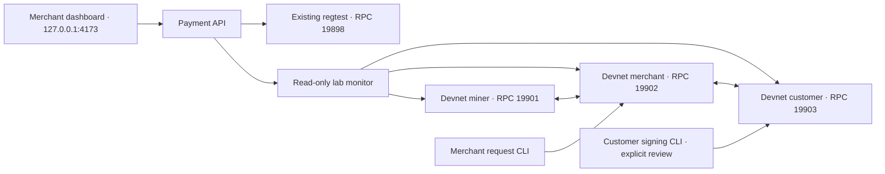

# Local development architecture

There are two separate chains. Invoice payments in the existing web application
use the original isolated regtest. The Network page observes the named
`atlas-local-v1` devnet. Sending coins on one does not pay an invoice on the other.

## Boundaries

- The web application has no lab signing or lab mining endpoint. Its lab
  capability is a read-only status snapshot.
- Each devnet node has a distinct data directory, RPC port and wallet role.
  P2P links are restricted to the configured loopback peers.
- Monitoring uses credentials limited to chain and peer inspection. Node
  administrator cookies are reserved for the local lifecycle and signing tools.
- Customer signing happens through the customer node. The signer reviews the
  concrete transaction before approval and persists its broadcast record.
- All components still run under the same local operating-system user. Filesystem
  permissions separate these tools from other users, not from a compromised
  process running as that same user. This is not production custody isolation.

## Network identity

Dash named devnets share a base block at height zero. Their distinguishing block
is at height one. Tools must check the exact chain name and both pinned hashes
before a mutating operation. A generic `chain == devnet` or base-genesis check is
insufficient. Test address prefixes and PSBT data do not identify the devnet;
payment requests must carry its explicit identity.

## Before integrating this signer into public checkout

Use separate customer devices or accounts, a reviewed request-authentication
scheme, merchant watch-only infrastructure, authenticated merchant operations,
recovery and backup procedures, and independent review of the signing boundary.
The local regtest's demo pay/refund endpoints must never become public custody
endpoints. Bank/card acceptance and international fiat payouts remain separate
future integrations.
